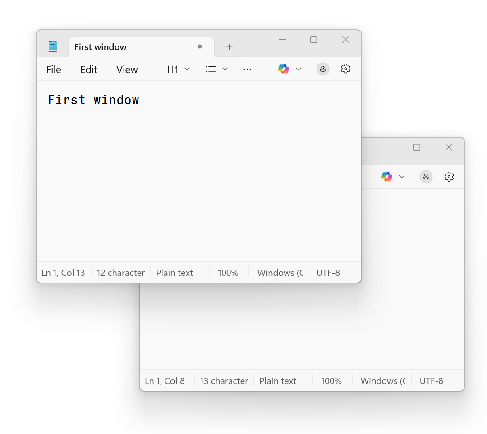

# goggles
* `dotnet build Goggles.csproj`
* Run the application, it sits in the tray.
* By default, Ctrl+Windows+F11 toggles transparency.

## Future
* Windows can support windows you can click through with `WS_EX_TRANSPARENT`, and it can also support always on top. I don't need always on top (PowerToys does that for me) but I would like to have click-through, which might only be useful if they're always on top.
  * I'll need a hotkey for that, to set a window
  * I don't know if I'd be able to make the window my active window again, so maybe I'll need another hotkey to universally remove all `WS_EX_TRANSPARENT` styles.
* Maybe a sound when toggling? The system sounds aren't inspiring. It'd be an excuse to design sounds too.
* I'd like to play with the colorref transparency options.
* It would be nice to alter the transparency levels without having to do anything too complicated. Maybe an "alter" hotkey. 

## Past
* This started out as a request from our team leader to play with agentic AI. From there, I trimmed it down and made it read+run better, made an icon.
* I have complicated feelings about the world of AI programming, because there are many ways it's no different to how we all worked before.
* In general, I don't like it, but "vibe-coding" a v0.1 and working from there seems okay to me for now, so long as [the Unix philosophy](https://en.wikipedia.org/wiki/Unix_philosophy) is also followed. 
